# Handoff: Kataku — full screen set + usability refinements

## Overview
Kataku is a private, single-user language tutor (Michel Thomas method) for iPhone. The teacher carries all the load; the learner just speaks. This package contains the **design of every screen**, a set of **five usability refinements**, full **design tokens**, and a **screenshot of each surface** (in `screenshots/`, embedded below).

Design for this one user specifically: a person learning Indonesian, used **one-handed while walking Bali streets in hard tropical daylight**, in **10–15 min sittings interrupted by real life**, with a trained ear for whether a tutor voice and its corrections feel real. Both **dark** (evenings) and **light** (must survive direct sun) themes are first-class.

Hard product rules the implementation must never violate:
- **No red anywhere.** Errors / near-misses are green / amber / slate information, never failure states.
- **No streaks, XP, leagues, badges, daily goals, timers, or “overdue” mechanics.** Nothing converts absence into debt.
- **English is never spoken aloud** — only the target language ever has a voice. English is quiet on-screen text.
- **Never speak into a void:** every audio state (tutor speaking, mic warming, mic live) must be visibly true on screen. A still screen means idle; a visible “listening” affordance over a dead mic is the worst possible bug.
- **The learner ends the utterance, not a timeout.** Pauses are construction. Patience is designed in.

## How to read this package
The HTML files in `foundations/`, `home/`, `chat/`, `conversation/`, `review/`, `lessons/`, `settings/`, `story/`, and `usability/` are **design references authored in static HTML/CSS** — prototypes of look, hierarchy, and motion intent. **They are not production code to copy.** Recreate these designs in the target codebase’s environment (this is a mobile app — likely SwiftUI / React Native / Flutter) using its components, theming, and animation system. Map every value below onto the app’s token system rather than pasting hex/px inline. Each `screenshots/*.png` shows the rendered design; open the matching HTML for exact spacing/color.

## Fidelity
**High-fidelity.** Colors, typography, spacing, radii, and motion intent are final and specified below. Reference frame **iPhone 390×844**; verify one-handed reach down to ~360pt.

---

## Design tokens

Define these as the app’s theme variables (two themes, same variable names). Hex values are exact.

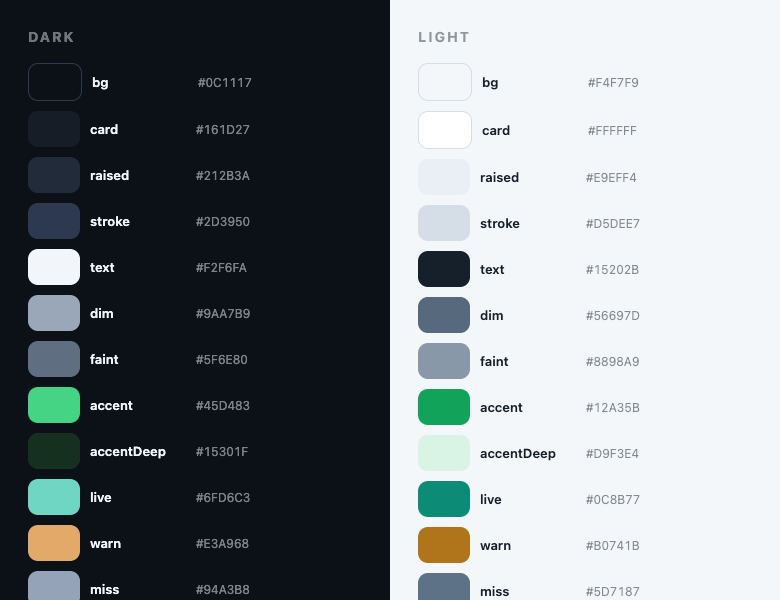

### Dark theme
| Token | Hex | Use |
|---|---|---|
| `bg` | `#0C1117` | screen background |
| `card` | `#161D27` | cards, taught-word card, bubbles base |
| `raised` | `#212B3A` | input fields, secondary buttons, segmented track |
| `stroke` | `#2D3950` | borders, dividers, spine, inactive meter |
| `text` | `#F2F6FA` | primary text |
| `dim` | `#9AA7B9` | secondary text, cue line, ambient English |
| `faint` | `#5F6E80` | tertiary / spend figure / captions |
| `accent` | `#45D483` | go / pass / progress, primary buttons |
| `onAccent` | `#07130C` | text/icons on accent |
| `accentDeep` | `#15301F` | learner bubble bg, resume/your-turn bg, “pass” wash |
| `live` | `#6FD6C3` | **learner’s own voice only** — transcripts, mic glow, resume/revisit |
| `warn` | `#E3A968` | **near-miss only** (muted apricot), nowhere else |
| `miss` | `#94A3B8` | “not yet” verdict (slate = information) |

### Light theme (current)
| Token | Hex | Notes |
|---|---|---|
| `bg` | `#F4F7F9` | |
| `card` | `#FFFFFF` | |
| `raised` | `#E9EFF4` | |
| `stroke` | `#D5DEE7` | |
| `text` | `#15202B` | |
| `dim` | `#3C4F63` | **bumped darker** (was `#56697D`) — see Refinement 2 |
| `faint` | `#5A6E82` | **bumped darker** (was `#8898A9`) — see Refinement 2 |
| `accent` | `#12A35B` | |
| `onAccent` | `#FFFFFF` | |
| `accentDeep` | `#D9F3E4` | |
| `live` | `#0C8B77` | |
| `warn` | `#B0741B` | |
| `miss` | `#5D7187` | |

> One hue logic, two palettes: **green = go/pass/progress; teal = the learner’s own voice (and only that); apricot = near-miss only; slate = information.** No red exists in any role.

### Typography

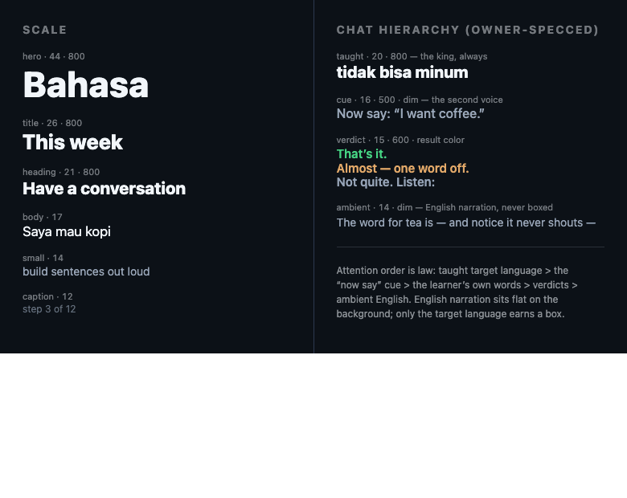

System stack: `-apple-system, 'SF Pro Text', system-ui, sans-serif`. Sizes in px (map to scaled fonts in-app).

| Role | Size / weight | Use |
|---|---|---|
| hero | 42–44 / 800, tracking −0.5 | language name (Home), big counter |
| title | 26 / 800 | screen titles (“This week”, “Your map”, “Settings”) |
| heading | 19–21 / 800 | section headers, CTA / story titles |
| body | 17 / 400 | learner bubble text |
| small | 14 / 400, color `dim` | ambient English narration |
| caption | 11–12 / 700, color `faint`, tracking, uppercase | section eyebrows, meta, spend, step counters |

**Chat hierarchy (owner-specced, strict order of attention):**
1. **Taught target word/phrase** — the visual king. Own `card`, 1px `stroke`, radius 16, padding 16, plus a play button. Text **20/800** (on the live-mic card tuned to **16px** for long transcripts — Refinement 3). Always clearly larger than the cue.
2. **“Now say:” cue** — second voice. **16/500**, `dim`. At least a step below the taught text.
3. **Learner’s own words** — right-aligned bubble, bg `accentDeep`, radius `24 24 10 24`, text 17.
4. **Verdict line** — **15/600**, colored by result: pass=`accent`, near-miss=`warn`, not-yet=`miss`. Always also worded (“That’s it.” / “Almost — one word off.” / “Not quite. Listen:”) so meaning survives color washout.
5. **Ambient English narration** — flat text on the background, **14**, `dim`. Never boxed, never a bubble.

### Spacing / radius
- Card padding: 16 (chat) – 24 (Home CTAs). Screen padding: 22–24 horizontal, 60 top (status bar).
- Radii: 16 (chat/list cards), 18–20 (settings/story cards), 24 (Home CTA/cards), 999/pill (chips, segmented, moods), 50% (orb, mic, play, map dots).
- Inter-element gap: 8 (chat lines) – 16–18 (Home/settings sections).
- **Minimum hit target 44pt.** Taught-word card is tappable across its whole body (not just the play glyph).

---

## Refinements to apply (a primary reason for this handoff)

Each is documented as **before → after** on iPhone frames in `usability/<file>.html`. Apply all five across the screens.

### 1 — One-handed reach
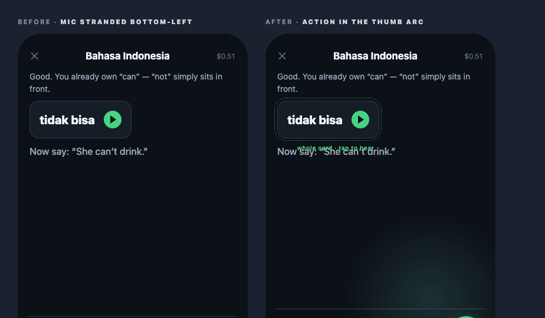
- **Problem:** the most-tapped control (mic) sat bottom-**left** of the input bar — hardest reach for a right thumb; send (32px) and ✕ (17px) were ambiguous.
- **Fix:** input field spans full width; a single **60×60 primary mic button** anchors **bottom-right** in the thumb arc (`accent` bg, shadow `0 6px 22px rgba(69,212,131,.4)`). **Send folds into that same control** once words exist — one bottom-right action, never two. The **✕ stays top-left** (rare, safe to miss). The **entire taught-word card** is the play hit target (≥44pt), not the 30px circle.

### 2 — Daylight survival
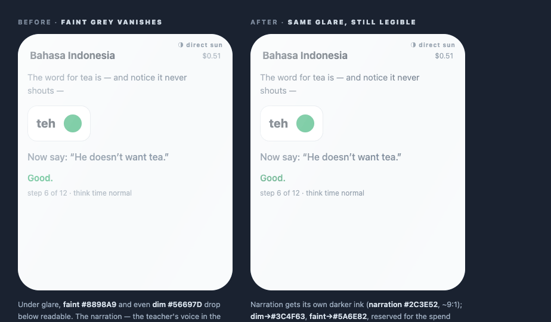
- **Problem:** under direct-sun glare, light-theme `faint #8898A9` and even `dim #56697D` drop below readable; the ambient English narration vanishes exactly when walking outdoors.
- **Fix (light theme):** give narration its own darker ink and raise the greys:
  - **narration** `#2C3E52` (~9:1) for ambient English
  - `dim` `#56697D → #3C4F63`
  - `faint` `#8898A9 → #5A6E82` (reserve `faint` for the spend figure only)
  - pass-green `#12A35B → #0B7C45` so the verdict color survives the wash
- **Plus auto-theme:** follow the **ambient-light sensor** (fallback: local sunrise/sunset) so the sun-readable palette is simply on outdoors. Manual override always wins and persists. (Home’s light theme + Settings → Appearance already carry this.)

### 3 — Honest live mic in the teacher chat
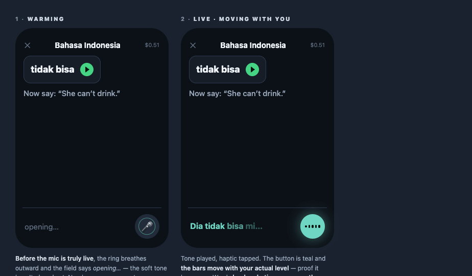
Fixes the one place the first design contradicted “never speak into a void.” The chat input mirrors the conversation orb’s honesty with **three states**:
- **Warming:** field reads “opening…”, a ring **breathes outward** around the mic, button NOT teal — the open-tone hasn’t played and nothing is captured yet. `@keyframes warm`: scale .7→1.55, opacity .8→0, 1.2s ease-out.
- **Live:** soft tone + light haptic; button turns **teal `live`** with glow `0 0 26px rgba(111,214,195,.5)`; **level bars move with actual mic input** (`@keyframes bob`, 5 staggered bars) — proof it hears you. Captured words **land verbatim, teal, as spoken** (never paraphrased/truncated).
- **Done:** closing tone, glow gone; the captured line is **editable (tap any word) before send**; nothing auto-fires; send sits ready, not pushed.
- **Tuned sizes (final, from the in-page Tweaks tool):** captured/editable text **16px** (range 13–20; smaller so long answers wrap less), cue **15px** (13–17), mic diameter **48px** (40–56). Exposed as `--ans-size`, `--cue-size`, `--mic-d` in the prototype; treat the stated defaults as ship values.
- `prefers-reduced-motion: reduce` disables the ring + bars (state still legible via color/label).

> The prototype loads a dev-only Tweaks panel (`usability/tweaks-panel.jsx`, React/Babel) for live size-tuning — **ignore it in the build**; it is tooling, not UI.

### 4 — Leaving is safe
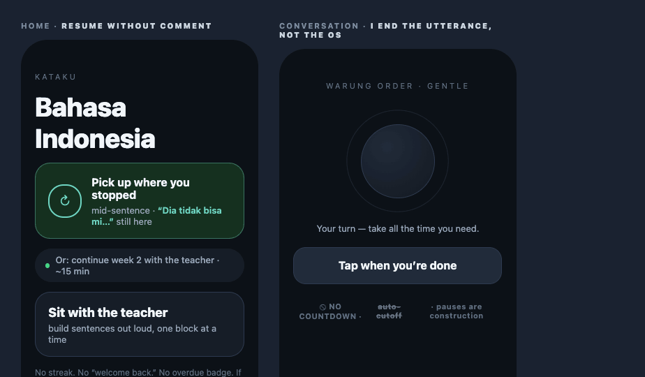
- **Home — resume without comment:** a half-spoken sentence and scroll position **persist** across interruption. A distinct **resume card** (bg `accentDeep`, 1px `live` border, `↻` icon) restores the exact spot in **one tap**, showing the preserved fragment (e.g. “Dia tidak bisa mi…”). Quieter than, and separate from, the single suggestion chip. **No streak, no “welcome back,” no overdue badge** — an empty yesterday is greeted identically.
- **Conversation — “I end the utterance, not the OS”:** a **hard floor** before any turn can end; long silences tolerated without comment; the turn ends only when the learner **finishes their thought or taps**. Replace every countdown/auto-cutoff with one **large labelled affordance** (“Tap when you’re done”). Closing mid-sentence never prompts “are you sure?”.

### 5 — One focal element
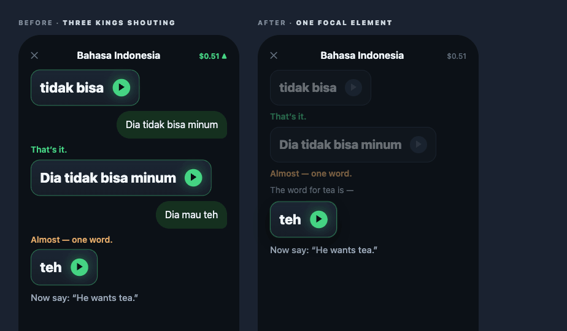
- **Problem:** every past taught card was as loud as the current one (three lit play buttons); the spend figure pulsed for attention. Screen read as a document to scan.
- **Fix:** **history recedes to `opacity: .4`** with **unlit** play buttons (fill = `stroke`); the **current card lifts** — `scale(1.02)`, gradient bg `#1b2533→#161D27`, `accent` border ~45% + soft glow, and owns the **only glowing play**. The **spend figure goes inert**: `faint`/slate, no arrow, never pulsing. One focal element per moment.

---

## Screens / views

All are iPhone frames; both themes unless noted.

### Home (`home/home.html`)
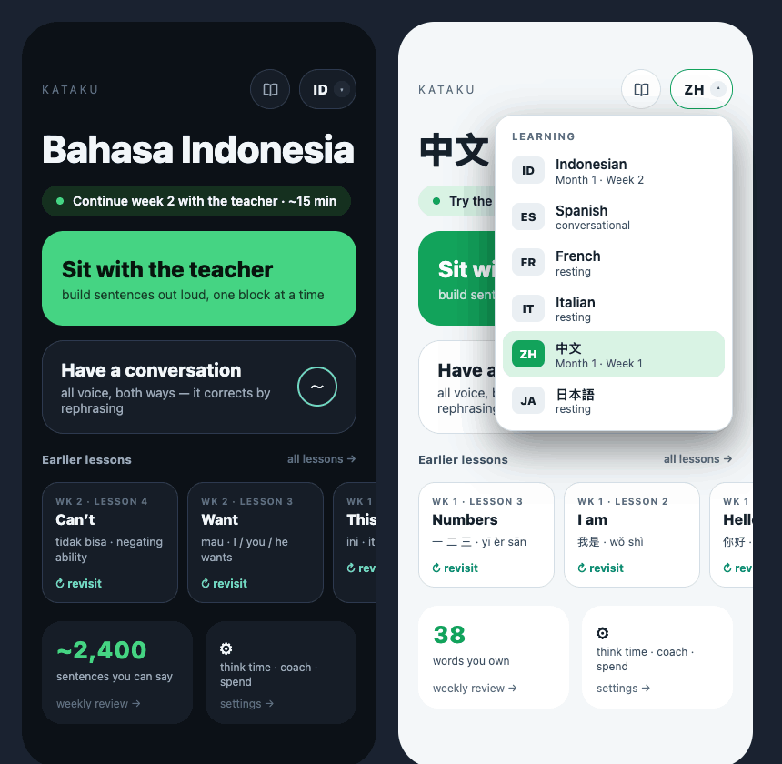
- **Purpose:** menu with one suggestion, never a gate.
- **Layout (top→bottom):** header row [brand “kataku” left · **book button + language bubble** top-right]; hero = language name (42/800); suggestion chip; “Sit with the teacher” CTA (accent, 25/800); “Have a conversation” card (teal wave glyph); **Earlier lessons** horizontal strip; stats row [sentences-you-can-say → weekly review · settings].
- **Stories entry:** a **42px circular book-icon button** sits just left of the language bubble (top-right cluster `[book] [ID ▾]`) — `card` bg, `stroke` border, `dim` icon — opening the **Stories** library. Minimal footprint by design; Stories is a side door.
- **Language bubble → picker:** compact **42px** pill top-right with active code (`ID`/`ZH`) + caret. Tap pops a **244px popover** (card bg, radius 20, shadow `0 18px 44px rgba(0,0,0,.5)`) listing all languages with name + protocol position (“Indonesian · Month 1 Week 2”, “Spanish · conversational”, others “resting”); current row highlighted with `accentDeep` bg + `accent` code badge. Replaces the old always-visible chip row.
- **Earlier lessons strip:** horizontally scrolling cards (min 150px): week/lesson eyebrow (`faint`), topic (16/800), words taught (`dim`), teal `↻ revisit`. “all lessons →” opens **Your map**.
- **Tone:** identical warmth regardless of yesterday. Suggestion is an ignorable shortcut.

### Teacher chat (`chat/teacher-exchange.html`)
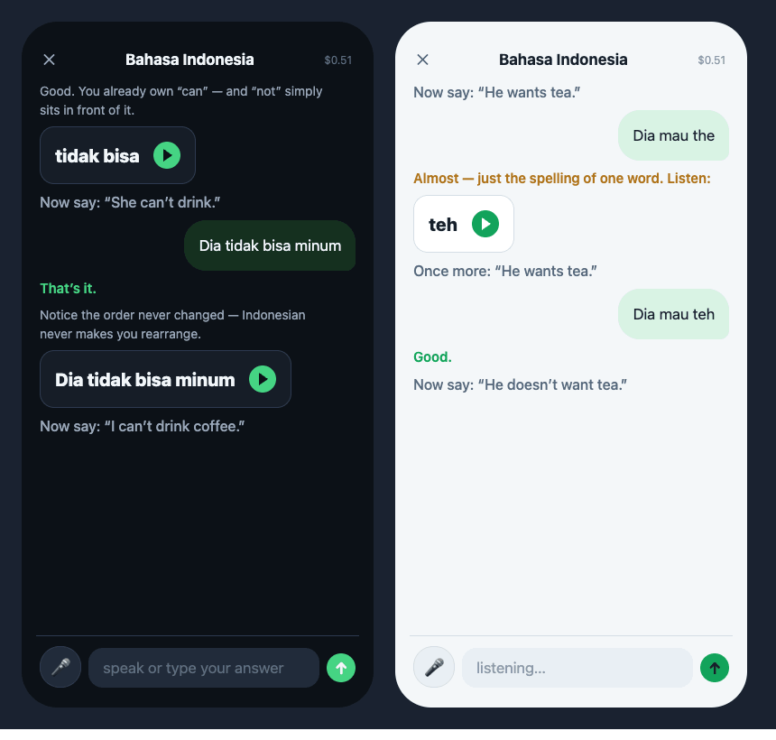
- **Purpose:** the primary lesson — a text-first conversation with the tutor. Apply Refinements 1, 3, 5 here.
- **Layout:** top bar [✕ · language title · month-to-date spend]; scrolling chat column following the chat hierarchy; input bar at bottom.
- **Behavior:** tapping a taught card speaks **exactly the words on the card** (teaching pace, a beat of air per word) — never the surrounding sentence. Tutor “thinking” = pulsing dots (the only motion). Verdict lands quietly in color + words. If audio can’t fetch: **silence + one quiet line that the text has everything** — never a robot fallback voice. For Mandarin/Japanese the card is **dual-script**.

### Conversation — orb states (`conversation/orb-states.html`)
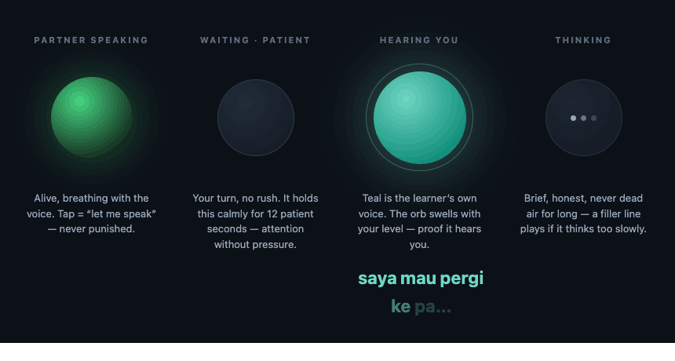
The orb is the partner’s face during listening; **what you see is always what’s true.** Four first-class frames:
- **Partner speaking:** large `accent` radial orb, glow, breathing with the voice. Tap = “let me speak,” never punished.
- **Waiting · patient:** quiet `raised` orb with `stroke` ring; holds calmly (~12s) — attention without pressure.
- **Hearing you:** larger **teal** orb + ring; **swells with mic level**; learner’s words fade in beneath, big and teal, word by word.
- **Thinking:** dim orb with three thinking dots; brief; a filler line plays if it thinks too long — never long dead air.
> Crucial: the app **waits a couple seconds before listening**; the teal hearing-orb appears **only when the mic is genuinely capturing**.

### Conversation — setup & debrief (`conversation/setup-debrief.html`)
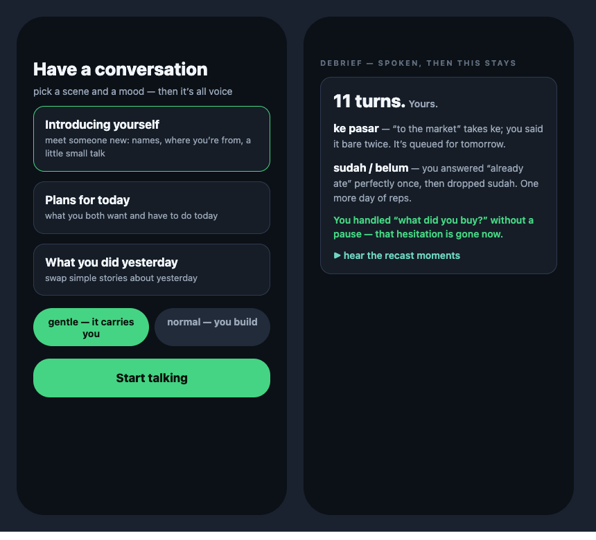
- **Setup:** one screen — scenario cards (each a stated goal), a mood toggle (`gentle — it carries you` / `normal — you build`), one big **Start talking** button.
- **Debrief:** spoken first, then this stays — “11 turns. Yours.”, recasts to revisit (“ke pasar … queued for tomorrow”), one specific compliment (`accent`), a teal **▶ hear the recast moments**. Warm, specific, English on screen, never spoken.

### Weekly review (`review/weekly.html`)
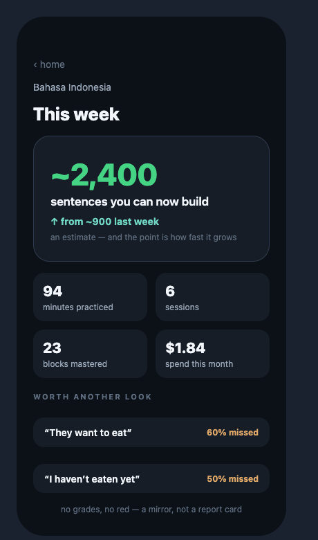
- **Purpose:** the emotional centerpiece — a mirror, not a report card.
- **Order of impact:** (1) **speakable-sentences counter** hero — “~2,400 sentences you can now build,” teal delta “↑ from ~900 last week,” honest “an estimate — and the point is how fast it grows” (give this a real reveal); (2) honest stats grid (minutes, sessions, blocks, month spend); (3) “worth another look” — toughest items with a muted-apricot miss %; (4) closing line. **No grades, no red.**

### Your map — all lessons (`lessons/mastery-map.html`) — NEW
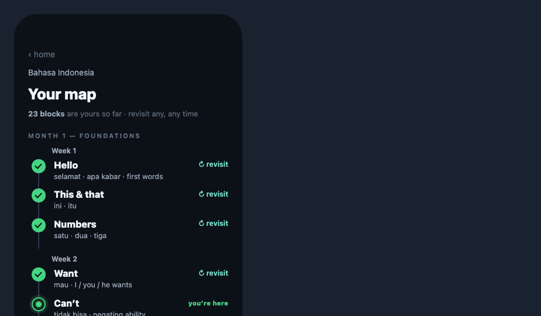
- **Purpose:** the “all lessons →” archive from Home — browse the whole protocol and revisit any lesson. A mirror, not a leaderboard.
- **Layout:** back ‹ home · eyebrow language · title “Your map” · a quiet mirror line (“**23 blocks** are yours so far · revisit any, any time”).
- **The map:** a **vertical spine** grouped Month → Week → lesson nodes. Each node = a state dot + topic (16/800) + the words it taught (`dim`).
  - **Done** = `accent`-filled dot with a check; teal **↻ revisit** action.
  - **Here** = `accentDeep` dot, `accent` ring + soft halo (`0 0 0 4px rgba(69,212,131,.16)`), `accent` core; “**you’re here**” label.
  - **Ahead** = hollow dot with `stroke` border; topic/words in `faint`/`stroke`; **no lock iconography** — labelled “ahead,” never “locked.”
- Future months get an “· ahead” section label in a quieter ink. Footer: “nothing locked — wander ahead or back whenever you like.” Inherits Refinement 5’s recede/lift logic (past muted, current emphasised).

### Settings (`settings/settings.html`) — NEW
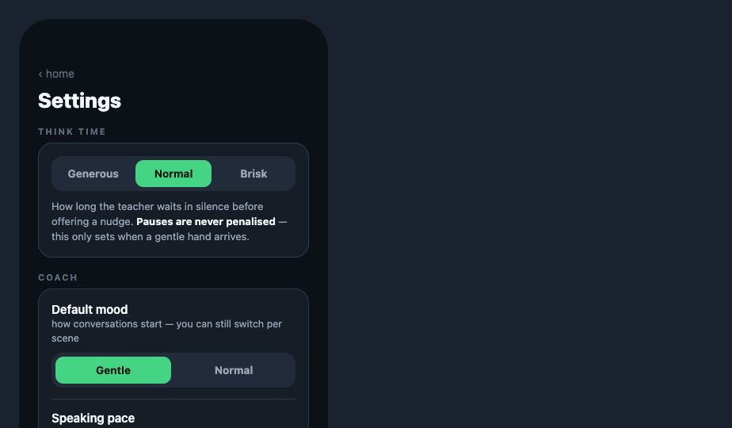
- **Purpose:** the “settings →” target — think time · coach · spend · appearance. Calm, no account/notification gamification.
- **Think time** — segmented **Generous / Normal / Brisk** (default Normal): *how long the teacher waits in silence before offering a nudge.* Copy makes explicit **pauses are never penalised** — this only sets when a gentle hand arrives.
- **Coach** — **Default mood** segmented (Gentle / Normal; switchable per scene) and **Speaking pace** segmented (Slow / Teaching / Natural; “a beat of air between taught words”).
- **Spend** — month-to-date figure ($1.84) against a **soft cap** ($10) with a calm `accent` meter, plus a toggle “**Show running cost in lessons**” (the quiet figure top-right). Honest, never alarming — no hard cutoffs.
- **Appearance** — segmented **Auto / Dark / Light**; Auto follows the daylight sensor (Refinement 2), manual choice always wins.
- Footer: “private · just you and the teacher · no account, no sync.”
- **Pattern:** segmented control = `raised` track, `accent` selected pill with `onAccent` text; toggle = `accent` when on, white knob.

### Stories — the editorial sub-theme (`story/`) — NEW
Stories is a **passive immersion** feature: produced audio stories with a **synced bilingual transcript** you read along to (think guided audiobook, not a drill). It is intentionally given a warmer, more literary skin than the rest of the app — a quiet signal that this is leisure/content, not practice — while keeping the same teal voice-color and the same no-red / no-pressure rules.

**Editorial palette (Stories only).** Applies to both Stories screens; everything else in the app keeps the core tokens above.
| Token | Light | Dark | Use |
|---|---|---|---|
| `paper` | `#F4F0E8` (warm cream) | `#0C1117` | screen background |
| `card` | `#FFFFFF` | `#161D27` | story cards, transcript card |
| `ink` | `#2A2620` (warm near-black) | `#F2F6FA` | titles + transcript target-language |
| `sub` | `#8B867C` (warm grey) | `#9AA7B9` | English glosses, descriptions |
| `hair` | `#E7E1D5` | `#222C3B` | hairlines / card border (dark) |
| `teal` | `#15B49A` | `#34CDB2` | progress, play button, active line — the Kataku teal family, tuned brighter to match the reference |
| `badge` | `#ECE7DC` bg / `#948B7E` text | `#212B3A` / `#8696AB` | level pills |
| `track` | `rgba(40,30,15,.10)` | `rgba(255,255,255,.10)` | progress track |

**Type.** Titles and story names switch to a **serif — Newsreader** (Google, weights 500/600), the only place in the app that departs from SF Pro. Everything else (English glosses, badges, transcript body, timestamps) stays SF Pro. If the codebase already has a brand serif, substitute it; otherwise bundle Newsreader.

**Imagery (action required).** Every story has an **illustration** — a square thumbnail in the list and a wide hero on the player. The prototypes use warm CSS-gradient placeholders evoking each scene; **final art must be commissioned illustrations** (warm, painterly, scene-specific — see the user's reference). Wire them as `story.thumb` (≥144²) and `story.hero` (≥16:9, ~750×380).

#### Entry point — Home book button
A **42px circular book-icon button** sits in the top-right cluster, immediately left of the language bubble (`[book] [ID ▾]`), `card` bg + `stroke` border, `dim` icon. Tapping it opens Stories. It deliberately costs almost no space — Stories is a side door, not a primary mode.

#### Stories list (`story/stories.html`)
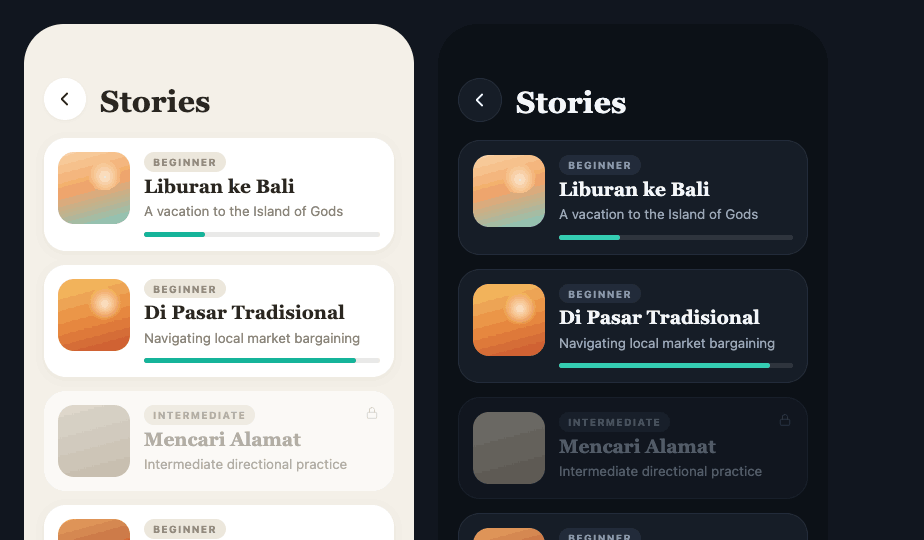
- **Layout:** circular back button + **“Stories”** serif title (30/600); a vertical list of story cards.
- **Story card:** `card`, radius 22, soft shadow (light) / hairline (dark); a **72² rounded illustration** left; right column = a **level badge** pill (Beginner / Intermediate), the **serif title** (19/600), a one-line English description (`sub`), and a **teal progress bar** on a faint track showing how far through you are.
- **Locked state:** advanced stories show a **lock glyph** top-right, drop to ~60% opacity, desaturated thumb, and omit the progress bar — gated by protocol level, never by streak or payment. Wording stays neutral (it’s “ahead,” not “forbidden”).
- Tapping a card opens the player.

#### Story player (`story/story-player.html`)
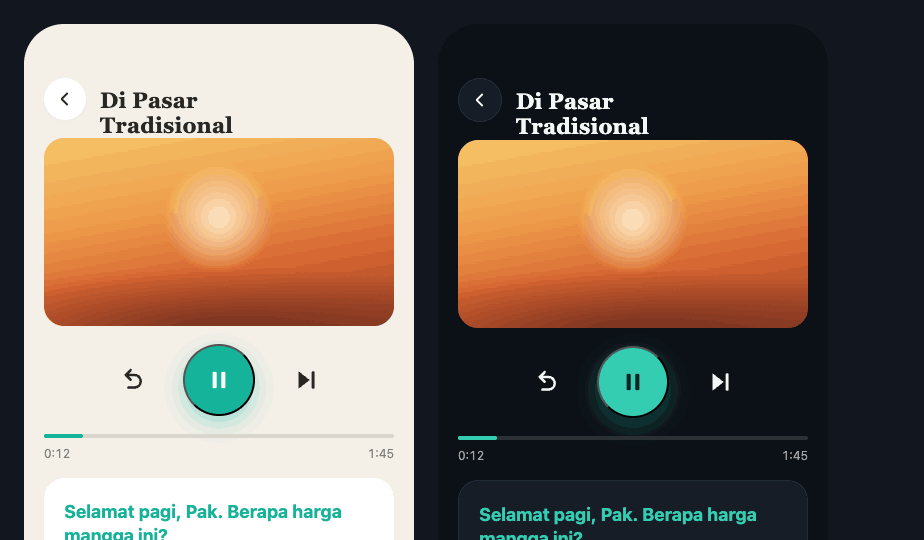
- **Layout (top→bottom):** circular back + **serif story title**; a **wide hero illustration** (radius 20, ~188 tall); a **transport row** — back-10s, a **72px teal play/pause** button (white glyph, soft teal shadow), skip-to-next-line; a **scrubber** (teal fill on faint track) with `0:12 / 1:45` timestamps; then the **transcript card**.
- **Transcript:** a `card` panel of utterances, each = **target-language line** (SF Pro 18/700, `ink`) + **English gloss** beneath (14, `sub`). The **currently-narrated line is teal** (`.active`) — karaoke-style; it advances with playback. The card’s bottom edge **fades out** (mask-image) to imply more below; it scrolls so the active line stays in view.
- **Color semantic:** teal = “the line you’re hearing now,” which keeps faith with the app-wide rule that teal marks the *live* voice.
- **No-pressure rules still hold:** nothing auto-advances past your control, no countdowns, English never spoken — only the target-language audio plays; the English is read, not voiced.

> Note: this **replaces** the earlier dark “speak-the-line” story-mode concept. The chosen direction (from the user's reference) is the read-along audio player above.

---

## Interactions & motion intent
Motion is **state, not decoration** — one entering movement per state change; springs, brief. The only idle motion allowed is the tutor’s **thinking dots** and the orb’s **breath**. Haptics mirror audio, never freelance.

| Transition | Expresses | Notes |
|---|---|---|
| taught card appears | “new word” | spring in, becomes the focal element |
| mic ring breathing (warm) | “warming — not yet live” | 1.2s ease-out loop; no capture |
| mic turns teal + bars move | “live, hearing you” | bars driven by real input level; open-tone + light haptic |
| words fade in (teal) | “your speech, verbatim” | per-word, never paraphrased |
| mic settles + closing tone | “heard you / turn done” | line becomes editable |
| thinking dots | “thinking” | only motion on an otherwise still screen |
| verdict color-in | “result” | quiet, colored + worded |
| orb swell | “listening, level” | teal; only when truly capturing |
| resume card → lesson | “pick up exactly here” | one tap, no confirm |
| story line advances | “follow along” | transcript active line moves to teal + auto-scrolls with audio; user keeps scrub control |

Prototype motion doesn’t export — **implement from these intent notes.** Respect `prefers-reduced-motion`.

## State management
- **Lesson/session state** persists continuously: current step, scroll position, **half-spoken input field** — so closing mid-sentence loses nothing and Home offers one-tap resume.
- **Protocol position** (month/week) drives the Home suggestion, the language-picker subtitles, and **Your map**’s done/here/ahead states.
- **Mic state machine:** idle → warming → live(level) → done(editable) → sent. The visible state must always equal the true audio/capture state.
- **Conversation turn state:** partner-speaking → waiting(patient, hard floor) → hearing(level) → thinking; turn ends only on learner finish/tap.
- **Story state:** per story — `locked` (by protocol level), `progress` (0–1, drives the list bar + resume point), `position` (transcript line index + audio time). Audio never auto-advances past user control; the active transcript line is derived from audio time. English is never synthesized to speech.
- **Theme:** auto from ambient light (fallback sun times) + manual override (persisted) — Settings → Appearance.
- **Spend:** month-to-date shown honestly, visually inert; soft cap only, no hard cutoff.
- **Audio fallback:** missing audio → silence + one text line; never a synthetic fallback voice; English never voiced.

## Assets
The core app UI uses **no raster assets** — orbs are radial gradients, controls/dots are CSS shapes, icons are glyphs/inline SVG (✕ ↻ ▶ 〜 ⚙︎ ✓ book, lock, transport). Recreate with the codebase's icon set and native shapes/gradients.

**Stories is the exception and needs real art:** each story requires a **square thumbnail** (list) and a **wide hero** (player) — warm, painterly, scene-specific illustrations per the user's reference (Bali beach, market, etc.). The prototypes ship CSS-gradient placeholders; **commission illustrations to replace them.** Stories also loads one web font (**Newsreader**, serif) for titles.

Fonts: SF Pro / SF Pro Text app-wide; Newsreader for Stories titles only. The PNGs in `screenshots/` are design references, not assets to ship.

## File index
**Screens**
- `home/home.html` — Home (language bubble + **book button → Stories** + earlier-lessons strip) → `screenshots/01-home.png`
- `chat/teacher-exchange.html` — teacher chat (apply Refinements 1, 3, 5) → `02-teacher-chat.png`
- `conversation/orb-states.html` — orb listening states → `03-orb-states.png`
- `conversation/setup-debrief.html` — conversation setup + debrief → `04-conversation-setup-debrief.png`
- `review/weekly.html` — weekly review → `05-weekly-review.png`
- `lessons/mastery-map.html` — **NEW** Your map / all lessons → `06-mastery-map.png`
- `settings/settings.html` — **NEW** Settings → `07-settings.png`
- `story/stories.html` — **NEW** Stories list (editorial) → `08-stories.png`
- `story/story-player.html` — **NEW** Story player (audio + transcript) → `09-story-player.png`

**Refinements** (before→after)
- `usability/index.html` — hub linking all five → `00-usability-hub.png`
- `usability/reach.html` → `u1-reach.png`
- `usability/daylight.html` → `u2-daylight.png`
- `usability/live-mic.html` → `u3-live-mic.png`  ·  `usability/tweaks-panel.jsx` (dev-only, ignore in build)
- `usability/resume.html` → `u4-resume.png`
- `usability/calm.html` → `u5-calm.png`

**Foundations**
- `foundations/colors.html` → `f1-colors.png`
- `foundations/type.html` → `f2-type.png`

Open any HTML directly in a browser to inspect exact spacing and color; the matching `screenshots/*.png` is the rendered reference.
